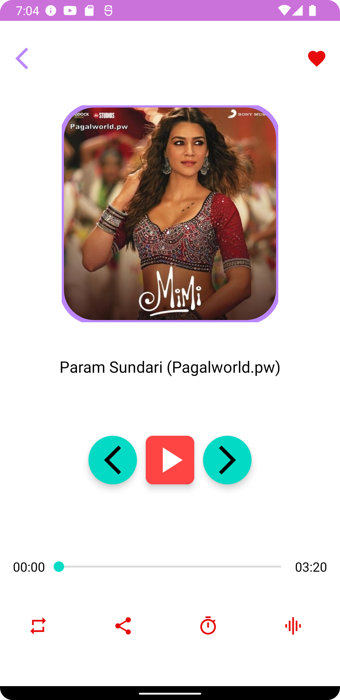
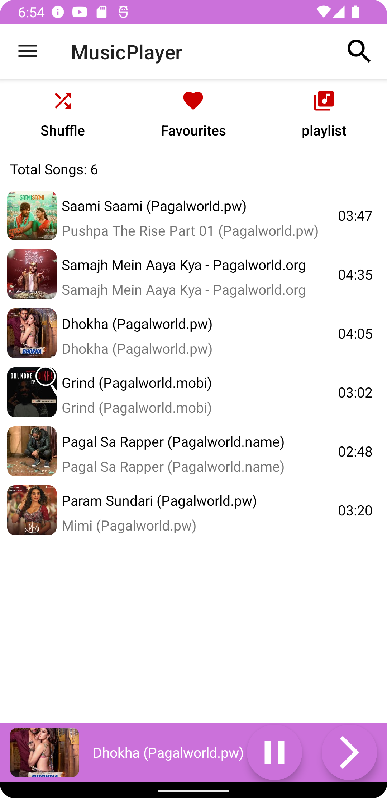
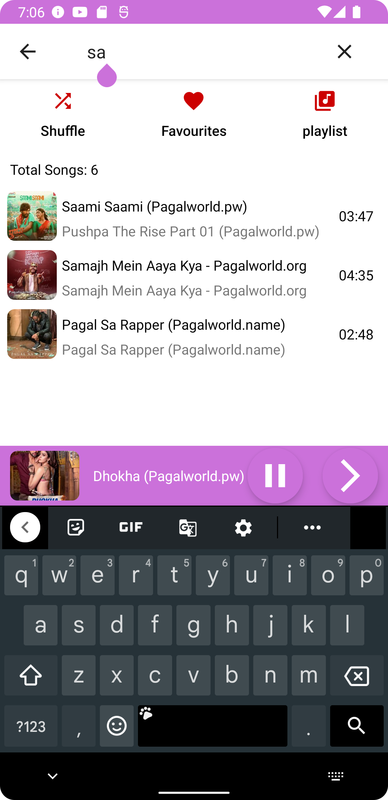
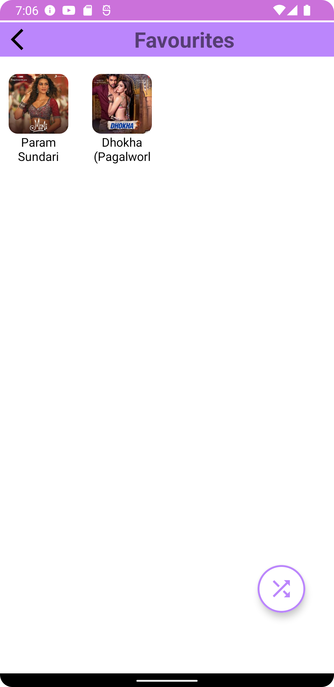
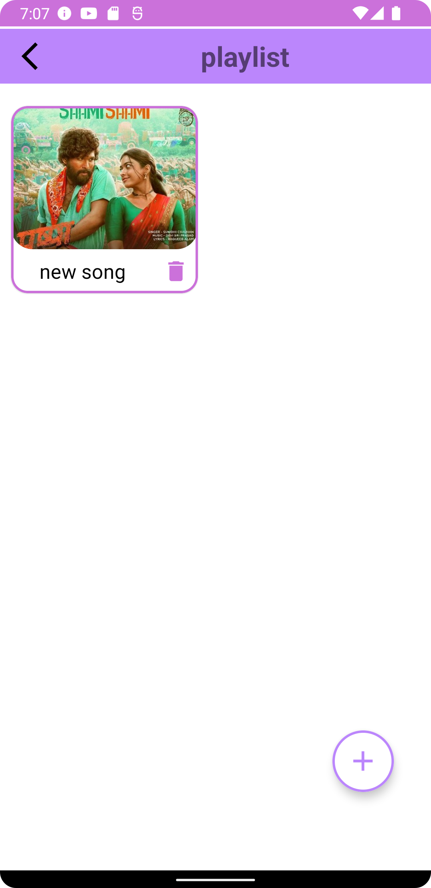
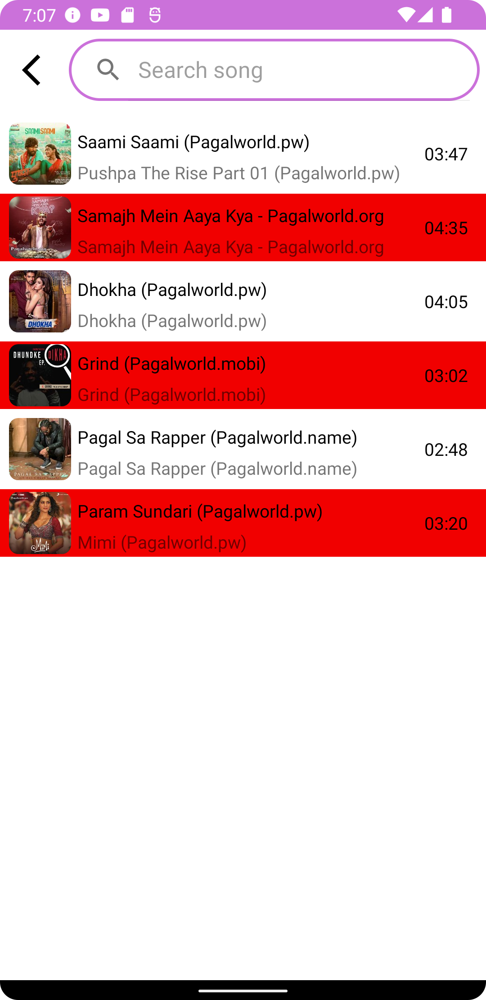
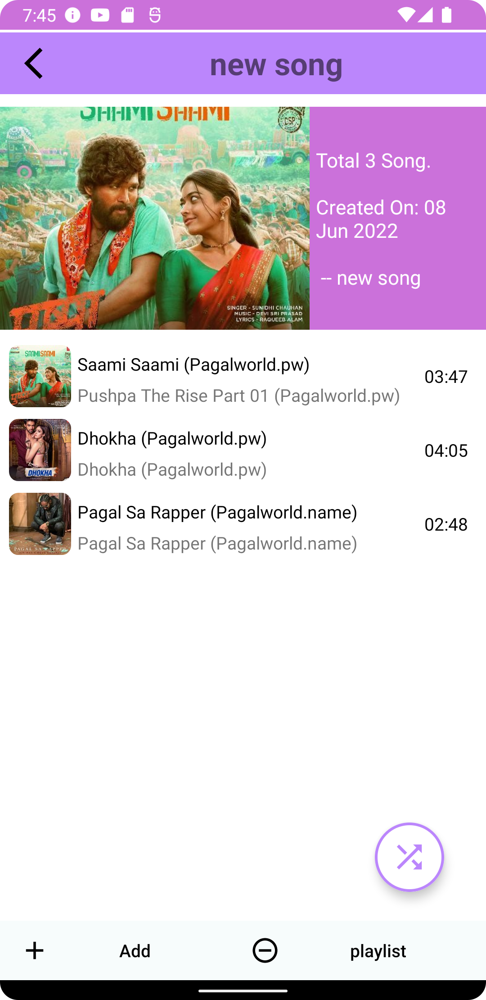
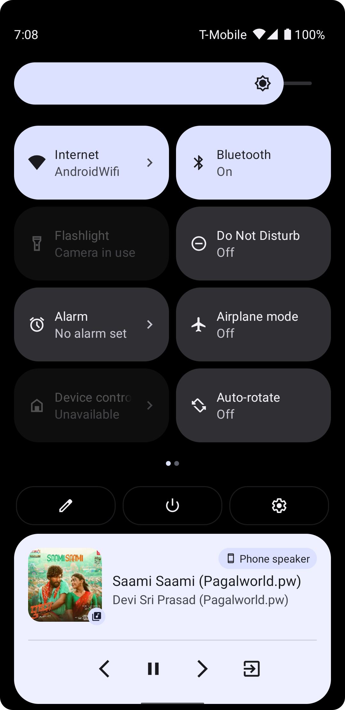

# MusicPlayer

👉 I am creating the MucisPlayer using the pure Kotlin language in android studio. In this MucisPlayer the load of feature like Playlist, Suffle, 
     favorate playlist etc.
     
# ScreenShots

&nbsp; &nbsp; &nbsp; &nbsp; &nbsp; &nbsp; &nbsp; &nbsp;
 &nbsp; &nbsp; &nbsp; &nbsp;
 
&nbsp; &nbsp; &nbsp; &nbsp; &nbsp; &nbsp; &nbsp; &nbsp;
 &nbsp; &nbsp; &nbsp; &nbsp;
 

# Pre-requisites

👉 Complete Basic of Kotlin.  
👉 UI basic is important.  
👉 Understating about the permission handler. 
👉 Understating about the adapters. 
👉 Understatiog about the fragments. 

# Getting Started

1. Download the starter code.
2. Open the project in Android Studio.
3. Complete the project and run it.

# Features

👉 Suffle   
👉 Playlist  
👉 Favoute list  
👉 Equalizer  
👉 Timer Set  
👉 Notification  
👉 Background Play  
👉 Offline player  
👉 Search bar 
